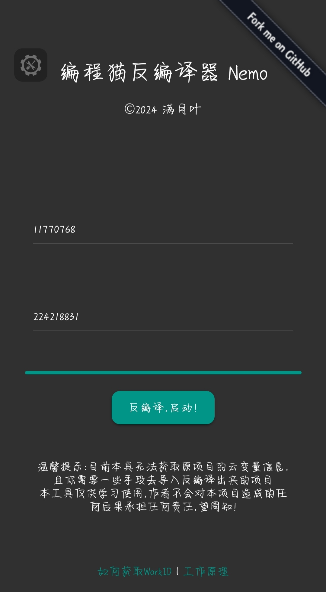

## 编程猫反编译器Nemo

如题，这是一个反编译器

但与其说是反编译器，其实应该叫做代码还原器，可以还原大部分 Nemo 作品的源代码以及资源文件

你可以在仓库文件的"样板"文件夹找到反编译的样本和新项目的样本

### 图片

### 使用

进入本项目的网页即可使用

### 已知问题

暂无，如有请到 Issues 反馈

### 鸣谢

* jQuery

* downloadjs

* JSZip

* MDUI
